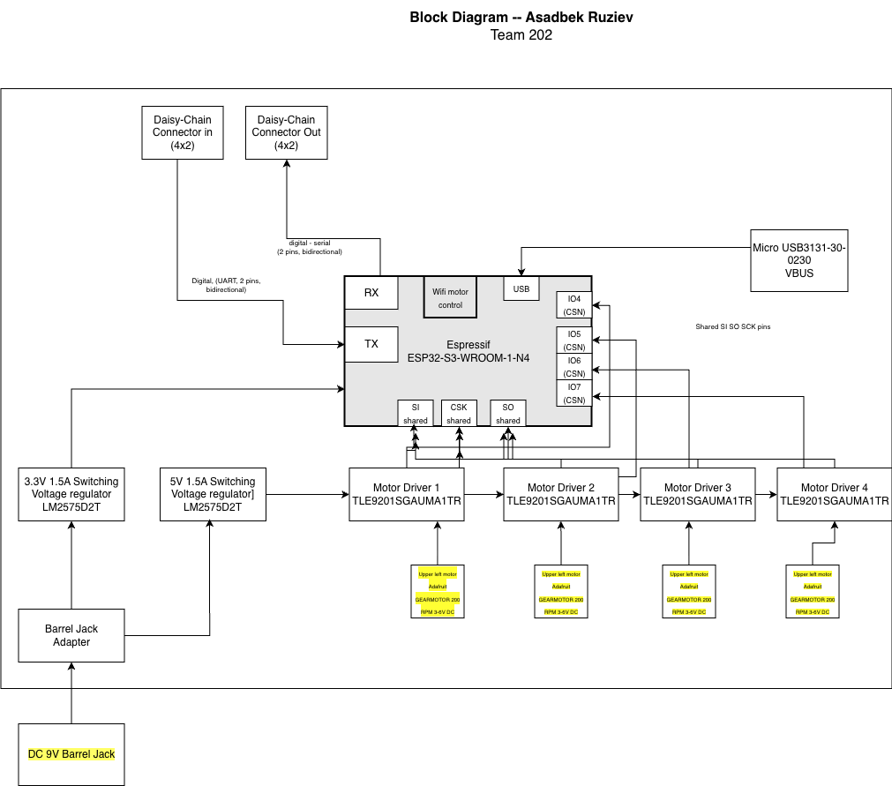

## Overview
Purpose of having block diagram is to help visualise my subsystem so that you can understand the workflow of code and schematics better. I have included 2 motors that are going to be parallel on the right. 2 motors on the left will also work together. I have planned to make the rover working with 2 motors together on each side, then making chassis as my stretch goal. This block diagram clearly shows how power, control and data will be floweing through my subsystem and to make the whole rover system work. Mobility of the rover is crucial to successfull launch of the project.

   

## Asadbek's Block Diagram 
Showing my screenshot of the block diagram here

### Impoortant Things to mention are following:
* ESP32-S3-WROOM-1
* 4 Motor Drivers
* 4 Motors
* Voltage regulator: 1 barrel jack  is going to be used twice through shared power for the team and inidividually. I will use 2 voltage regulatorsand one of them will be to convert voltage into the 3.3 V and 6V.
* Daisy chain connectors through 8-pin header connectors Connector In (4×2), Connector Out (4×2) and UART communication.
* USB
* Power levels: Unregulated power levels are going to be 9V for the motors, but the input to ESP 32 is 3.3V. For logic-level peripherals of my subsystem's ESP 32 I will use 3.3 volts. 
* Actuator: I will be using 4 same DC motors for smooth operation of the rover. 
* Team connections: I will be connecting my ESP32 to Caleb's board to oeprate better through RX and TX 
* Power source: barrel jack for the motors are main sources of power. 

SPI UART serial communication protocols are just alternative communication ways to connect to motors actuators sensor. All WiFi is done by esp32. 

