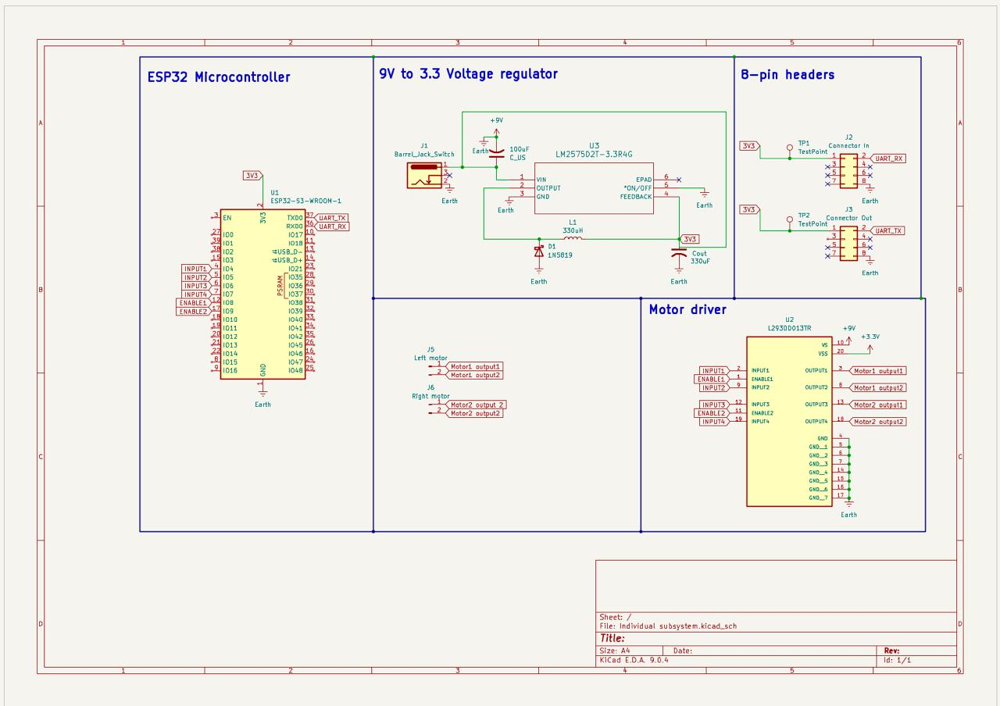

## Overview

This schematic is design to support motor, ESP32, motor driver subsystem. I will plan to use 4 motors in my subsystem. 

# Motor Driver
I am also going to use 2 L293DD motor driver. The motor driver is surface mount H-bridge. Enable 1 and Enable 2 allows to control the speed and input comes from the GPIO pins of ESP32, while output goes to motors.

# Motor
I am going to use 2 headers for my motors as it can not be surface-mount

# ESP32

{style width:"350" height:"300;"}
**Figure 1:** Showing my schematic

## Resources

The schematic as a PDF download is available [*here*](Kicad.pdf), and the Zip folder of the project [*here*](Individual Subsystem.zip).