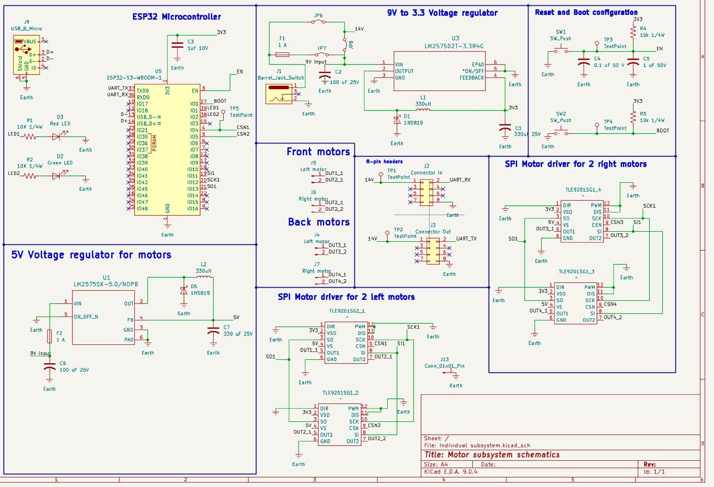

### Overview
This schematic is designed to support 4 motors, motor drivers, ESP32 subsystem. I will also going to be sending and receiving data through TX and RX of the 8-pin headers. Symbols were sourced from the Digikey website.

{style width:"350" height:"300;"}
**Figure 1:** Showing my schematic

### Key functional blocks

## 1. Microcontroller interface
* ESP32-S3-WROOM-1
* UART daisy chain interface 
* USB for programming
* Boot, reset buttons
ESP32 microcontroller is included in this schematic.

## 2. Motor Driver
* SPI configuration (SCLK, SDI, SDO, NSCS)
* PWM → PWM input for speed
* DIR → direction
* DIS → enable/disable
* VSO 
I am also going to use 4 motor drivers. The motor driver is surface mount H-bridge. Out1 and Out2 allows to control the speed and input comes from the GPIO pins of ESP32, while output goes to motors.

## Shared SPI
* GPIO11 → SI on all drivers
* GPIO13 ← SO on all drivers
* GPIO12 → SCK on all drivers
Since, I am going to use 4 motors together, I will have 3 shared SPI pins that go to the same ESP32 GPIO as above.

## 3. Motors
I am going to use 2 headers for each of my motors as it can not be surface-mount. In total, I will be using 4 motors that will be working with 4 motor drivers.
* 200 RPM 3-6V DC Gearmotor

## 4. Power Management
* 9V barrel jack for motors
* LM2575D 3.3 Voltage regulator
* Fuse for the barrel jack for safety

## Resources

The schematic as a PDF download is available [*here*](kicad_final.pdf), and the Zip folder of the project [*here*](Design_review.zip).