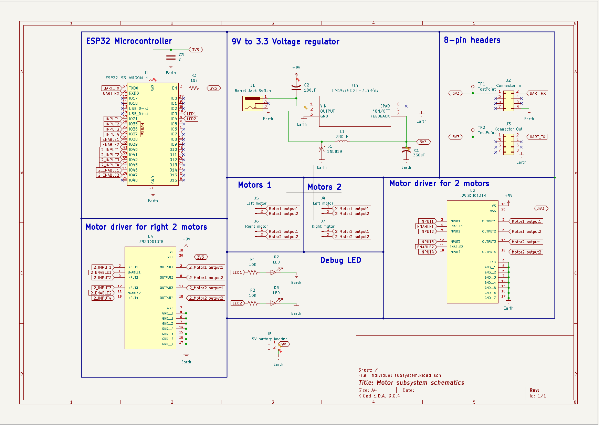

### Overview
This schematic is designed to support 4 motors, motor drivers, ESP32 subsystem. I will also going to be sending and receiving data through TX and RX of the 8-pin headers. Symbols were sourced from the Digikey website.

{style width:"350" height:"300;"}
**Figure 1:** Showing my schematic

### Key functional blocks

## 1. Microcontroller interface
ESP32 microcontroller is included in this schematic.
* ESP32-S3-WROOM-1
* UART daisy chain interface 
* USB for programming
* Boot, reset buttons

## 2. Motor Driver
I am also going to use 2 L293DD motor driver. The motor driver is surface mount H-bridge. Enable 1 and Enable 2 allows to control the speed and input comes from the GPIO pins of ESP32, while output goes to motors.
* SPI configuration (SCLK, SDI, SDO, NSCS)

## 3. Motors
I am going to use 2 headers for each of my motors as it can not be surface-mount. In total, I will be using 4 motors that will be working with 4 motor drivers.
* 200 RPM 3-6V DC Gearmotor

## 4. Power Management
* 9V barrel jack for motors
* LM2575 3.3 Voltage regulator
* Fuse for the barrel jack for safety

## Resources

The schematic as a PDF download is available [*here*](Kicad.pdf), and the Zip folder of the project [*here*](Individual Subsystem.zip).