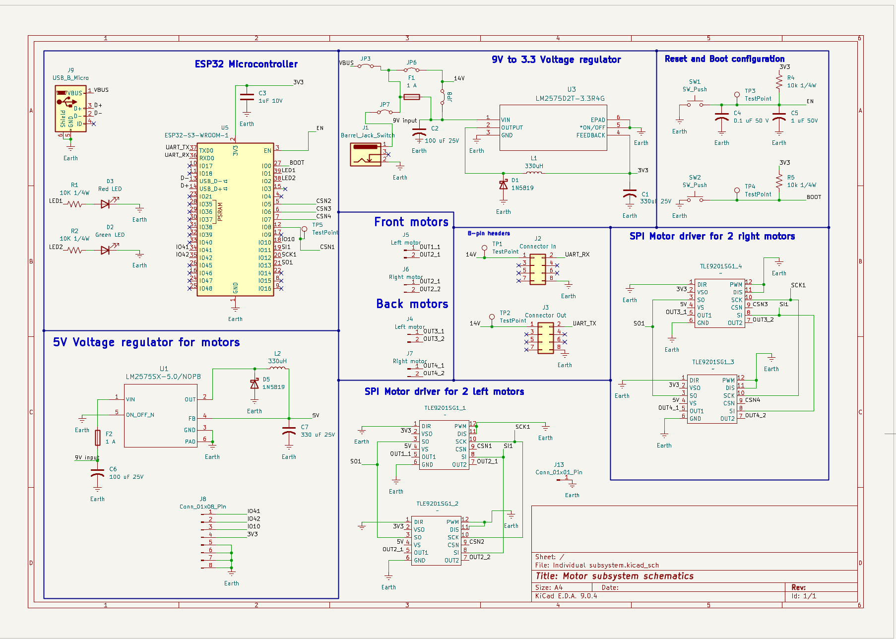

### Overview
This schematic is designed to support 4 motors, motor drivers, ESP32 subsystem. I will also be sending and receiving data through TX and RX of the 8-pin headers. Some symbols were sourced from the Digikey website, while a few others were from the KiCad library.

{style width:"350" height:"300;"}
**Figure 1:** Showing my schematic

### Key functional blocks

## 1. Microcontroller interface
* ESP32-S3-WROOM-1
* UART daisy chain interface 
* USB for programming
* Boot, reset buttons
* Extra pins for other potential usage
The ESP32 microcontroller is included in this schematic.

## 2. Motor Driver
* SPI configuration (SCLK, SDI, SDO, NSCS)
* PWM → PWM is not going to be used since it is SPI, so it will be grounded
* DIR → direction grounded (not used)
* DIS → enable/disable
* VSO 
I am also going to use 4 motor drivers. The motor driver is a surface-mount H-bridge. Out1 and Out2 allow control of the speed, and input comes from the GPIO pins of the ESP32, while output goes to the motors.

## 3. Shared SPI
* GPIO11 → SI on all drivers
* GPIO13 ← SO on all drivers
* GPIO12 → SCK on all drivers
Since I am going to use 4 motors together, I will have 3 shared SPI pins that go to the same ESP32 GPIO as above.

## 4. UART
* TX1
* RX1 
Since UART0 - TX0, RX0 gave me problems during the daisy chain, I updated the schematic to swap UART pins.

## 5. Motors
I am going to use 2 headers for each of my motors, as they can not be surface-mount. In total, I will be using 4 motors that will be working with 4 motor drivers.
* 200 RPM 3-6V DC Gearmotor

## 6. Power Management
* 9V barrel jack for motors
* LM2575D 3.3 Voltage regulator
* LM2575D 5.5 Voltage regulator for motor movement
* Fuse for both barrel jacks for safety
* The input power can be anywhere from 5V to 40 volts.
* If using team power, connect jumpers at JP6 and JP7
* For individual power supply, connect JP3
* For using motors with their own power, use JP7

## Resources

The schematic as a PDF download is available [*here*](Final_schematic.pdf), and the Zip folder of the project [*here*](EGR314-kicad-final.zip).