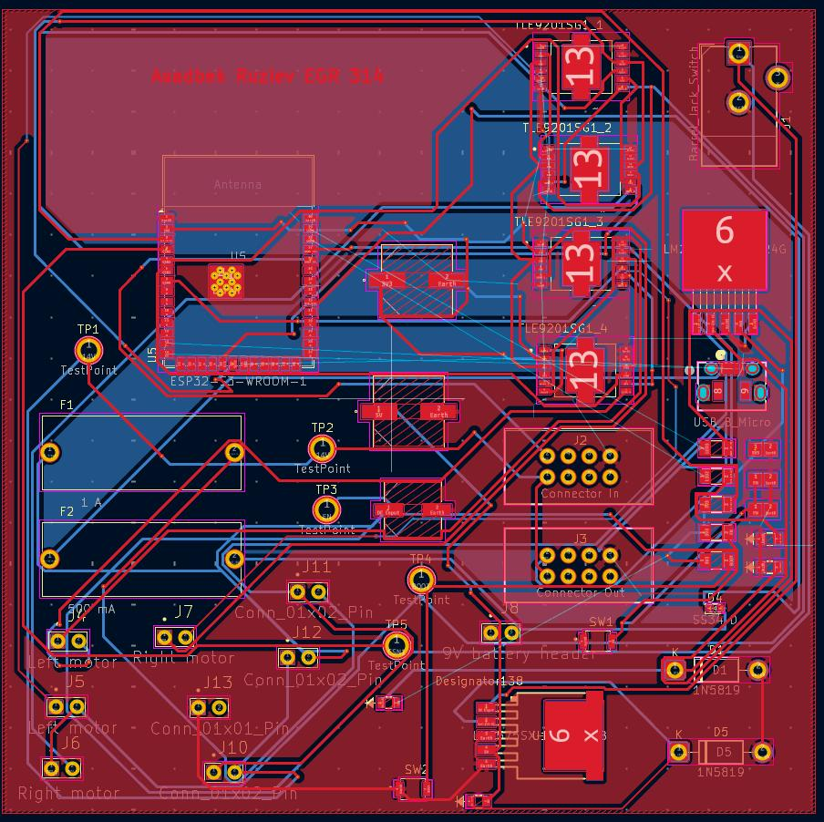
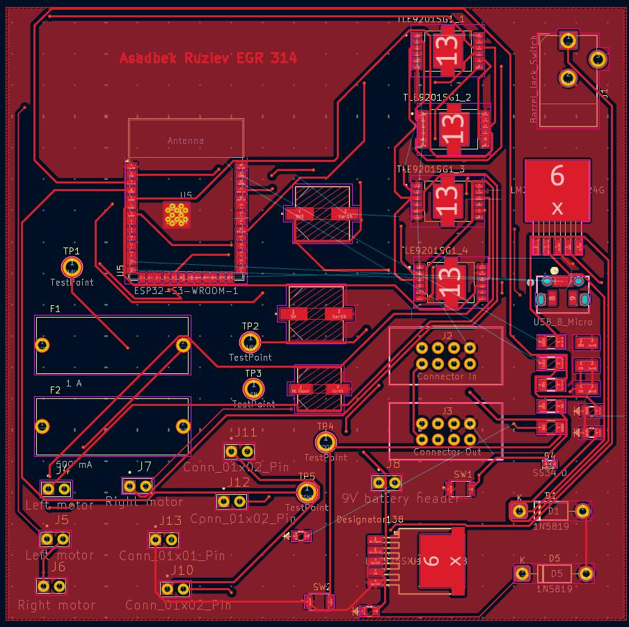

## Overview
This section is an overview of the PCB design for the Metal detection system for the CropScout.

{style width:"350" height:"300;"}

**Figure #1:** Front View of PCB.

{style width:"350" height:"300;"}

**Figure #2:** Back View of PCB.

**Resources**
Individual subsystem.zip

**Gerber files**
{style width:"350" height:"300;"}

The zip folder of the project [*here*](Individual subsystem.zip).
The gerber files of the project [*here*](gerber.zip).