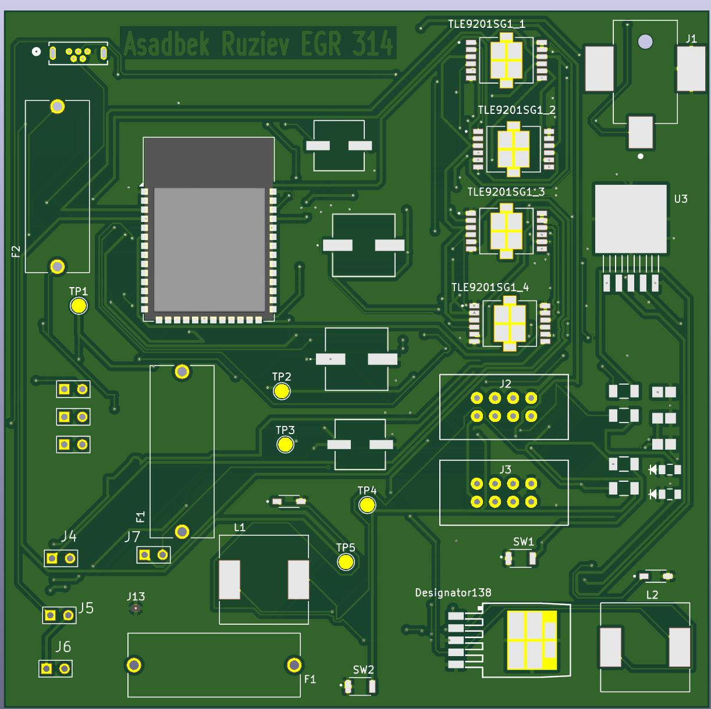
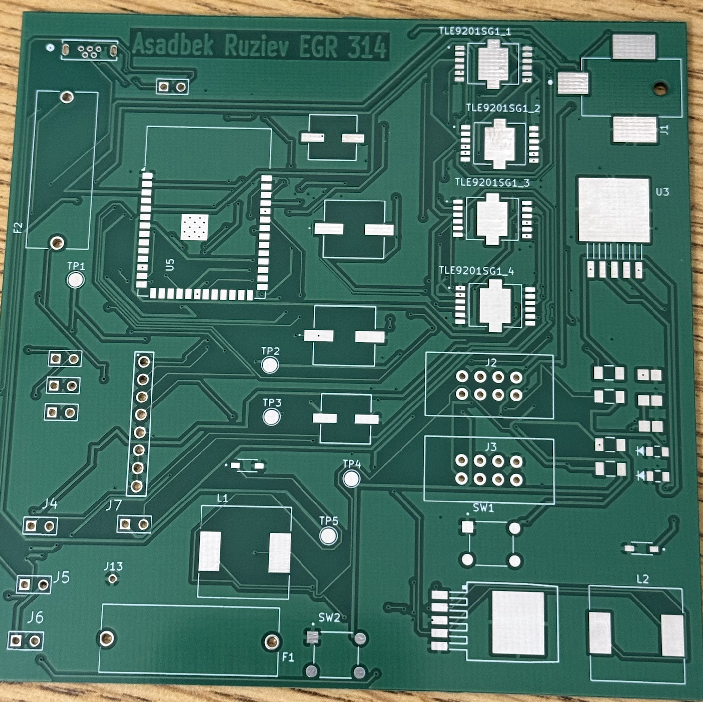
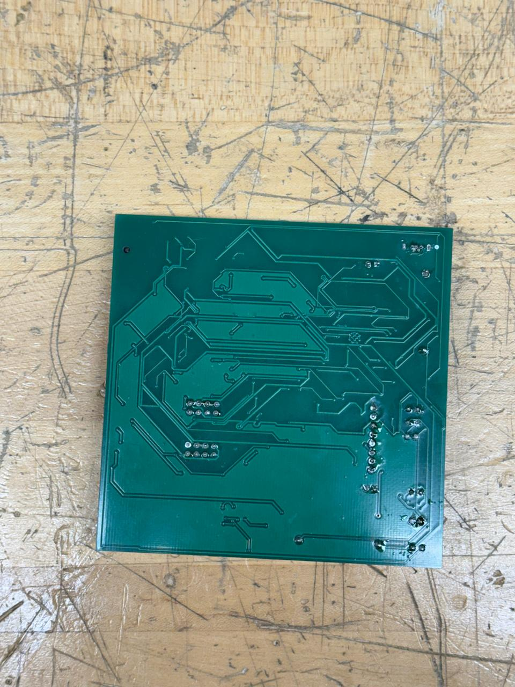
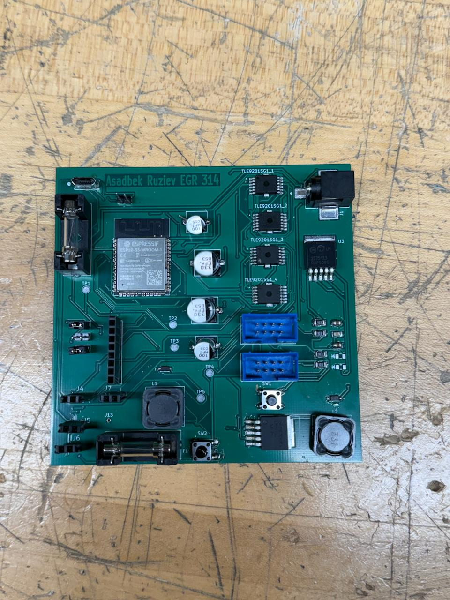

## Overview
This section is an overview of the PCB design for the Metal detection system for the CropScout. Some of the footprints are from the Digikey.

{style width:"350" height:"300;"}

**Figure #1:** Full View of PCB.

{style width:"350" height:"300;"}

**Figure #2:** Front View of PCB.

{style width:"350" height:"300;"}

**Figure #3:** Back View of PCB.

<<<<<<< HEAD
{style width:"350" height:"300;"}
=======
{style width:"350" height:"300;"}
>>>>>>> d1ab0351fcce91105b6e6388854c63e64ff8db13

**Figure #4:** 3D View of PCB.

{style width:"350" height:"300;"}

**Figure #5:** FrManufactured Front View of PCB.

{style width:"350" height:"300;"}

**Figure #6:** JLCPCB Back View of PCB.

{style width:"350" height:"300;"}

**Figure #7:** Soldered View of PCB connected to team Daisy Chain

**Resources**
Individual subsystem.zip

The zip folder of the project [*here*](Individual subsystem april version.zip).
The gerber files of the project [*here*](gerber.zip).