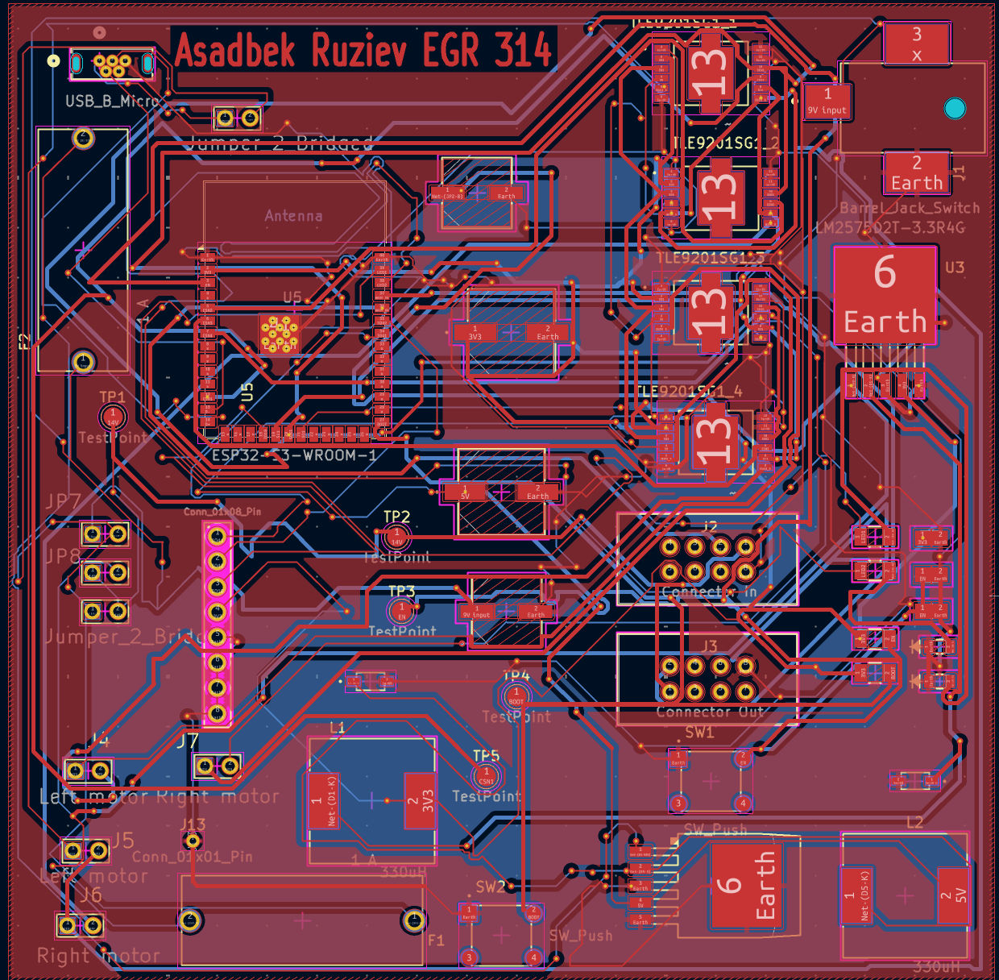
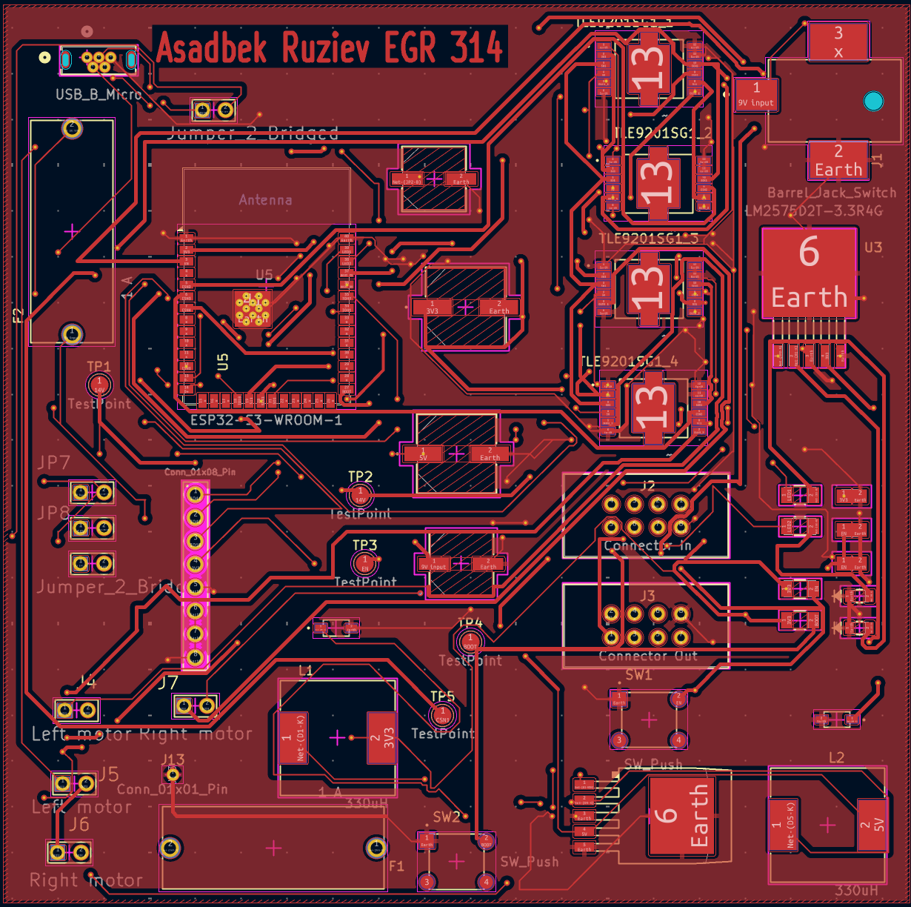
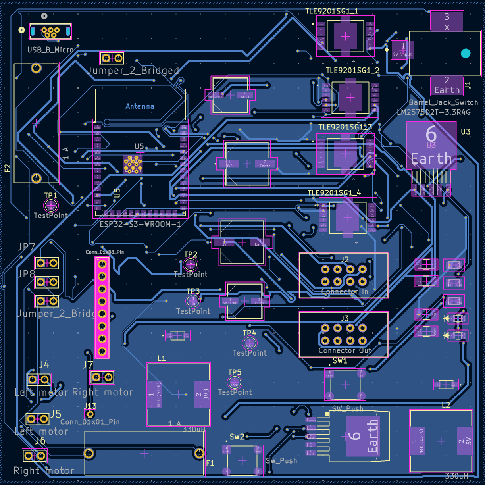
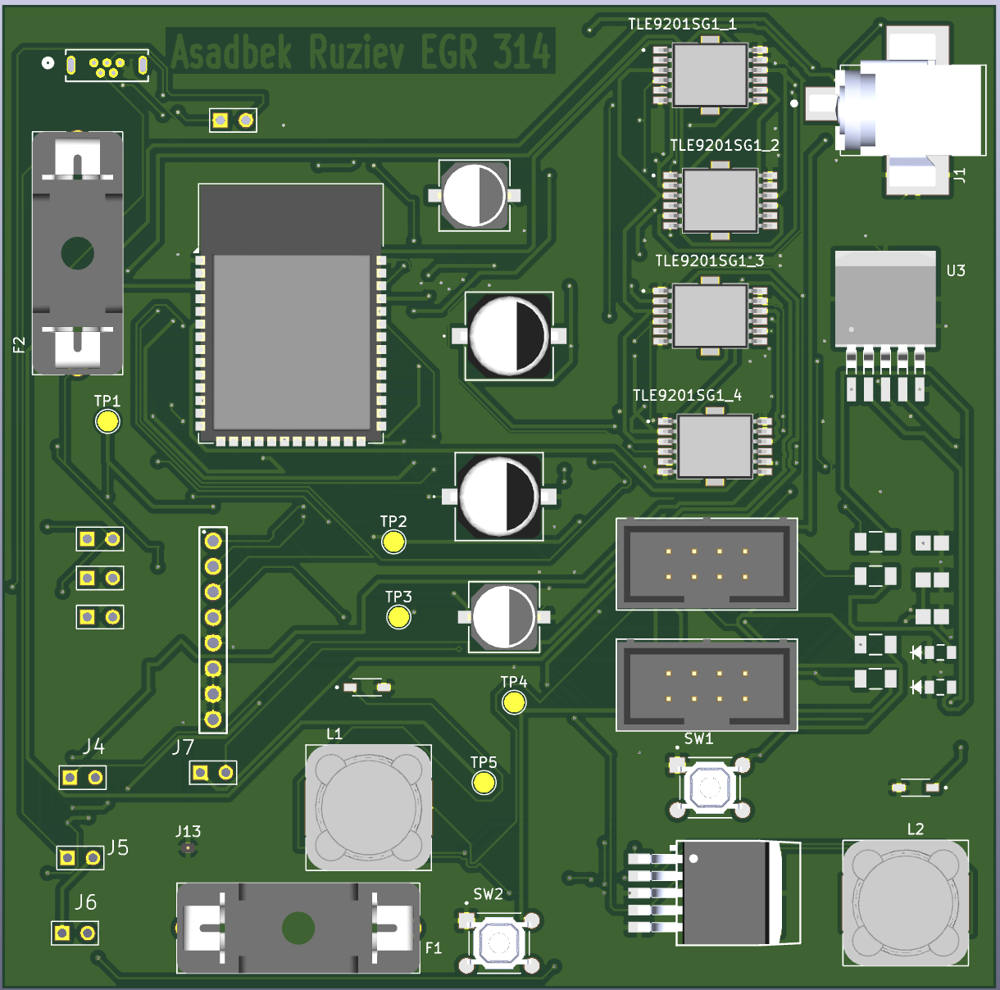

## Overview
This section is an overview of the PCB design for the Metal detection system for the CropScout. Some of the footprints are from the Digikey.

{style width:"350" height:"300;"}

**Figure #1:** Full View of PCB.

{style width:"350" height:"300;"}

**Figure #2:** Front View of PCB.

{style width:"350" height:"300;"}

**Figure #4:** Back View of PCB.

{style width:"350" height:"300;"}

**Figure #3:** 3D View of PCB.

**Resources**
Individual subsystem.zip

The zip folder of the project [*here*](Individual subsystem april version.zip).
The gerber files of the project [*here*](gerber.zip).