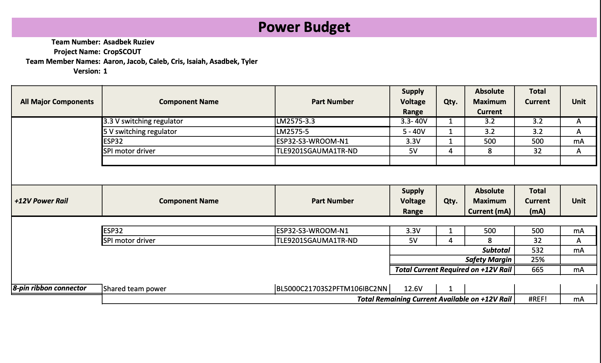
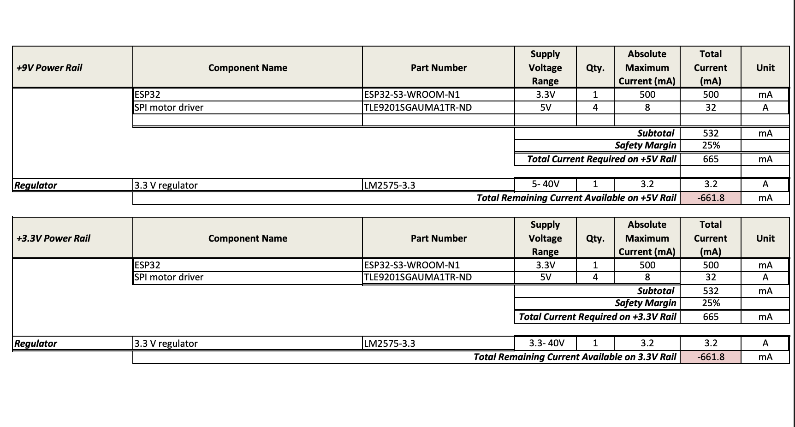
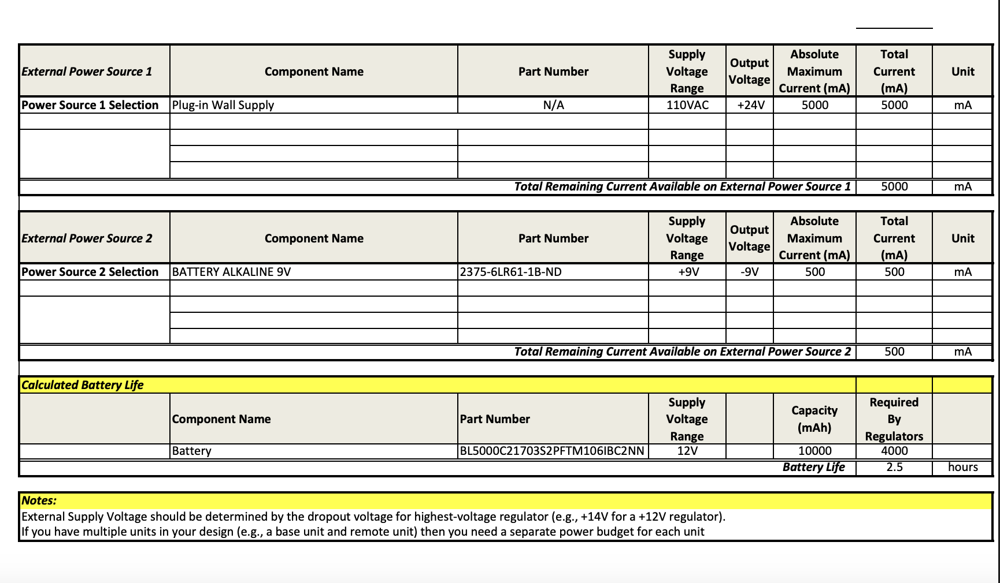

## Overview
Power Budget helps to understand more about the maximum current draw. This helsp to understand the choice of appropariate fuse. The power budget also helps to know if the subsystem is going to operate in different current scenarios.

> Capture your power budge as a image to display. Take time to get clean breaks and a well organized layout.

{style width:"350" height:"300;"}

{style width:"350" height:"300;"}

{style width:"350" height:"300;"}

## Conclusions

Power Budget helped me a lot to understand my current for ESP32 and to choose good fuse. I also was able to have board working without any problems.

## Resouces

The power budget as a PDF download is available [*here*](PowerBudget_EGR314.pdf), and a Microsoft Excel Sheet [*here*](PowerBudgeexcel.xlsx).