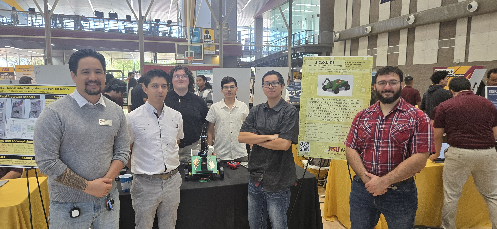

Asadbek Ruziev Datasheet 
as part of 
 Exploration Device Project 
for 
 Crop S.C.O.U.T.S.  

 Team 202  

**Submission: May, 4, 2026**

## Introduction

* Hi! I am highly passionate about mobile robotics for agriculture and ecology. Through my work at CropSCOUT at EGR 314, I gained in-depth knowledge and experience that I plan on using in future projects.

### Project Summary

* I am responsible for mobillity of <ins>the rover project.</ins> We are a team of 7 engineering students who are designing an explorative rover in 4 months. Please, take a look at the process of our design through the different tabs in the team report. fF you would like to learn more about other team members' subsystems, access the team report and follow the link for each member's website.
* To get more information about our teamwork, follow Team 202 [Team report.](https://egr314-s-2026-202.github.io/)

>From left ro right: Cale Yuen, Cristopher Gutierrez, Jacob Alger, Asadbek Ruziev, Aaron Kiem, Isaiah Johnston

### My Contribution 

* Our team is focused on making a land-based explorative rover project that drives to different places and uses its sensors to perform measurements. The Crop Scout is a ground-based, remotely operated, sensing and exploration rover. It is capable of going to any place and detecting metal, measuring temperature, and humidity. All data works through an MQTT connection and a UART
* I am responsible for the mobility of the rover using ESP32. I will be using 4 motors with wheels attached. Motors will be working through the motor driver to move the robot from a distance through WiFi.

To review the details listed of the material used to construct the subsection, you can review it in the ["Team"](https://egr314-s-2026-202.github.io/) section of the datasheet.

## Showcase Video Demo

<iframe width="560" height="315" src="https://www.youtube.com/embed/CgNYh9vksoY?si=5lFRXKqbXAz6XXHL" title="YouTube video player" frameborder="0" allow="accelerometer; autoplay; clipboard-write; encrypted-media; gyroscope; picture-in-picture; web-share" referrerpolicy="strict-origin-when-cross-origin" allowfullscreen></iframe>

To review the details of the data sheet, hyperlinks are provided below:  
[1. Requirements](https://mraruziev.github.io/Asadbek-EGR314/01-Requirements/Requirements/)   
[2. Block Diagram](https://mraruziev.github.io/Asadbek-EGR314/02-Block-Diagram/Block-Diagram/)   
[3. BOM](https://mraruziev.github.io/Asadbek-EGR314/04-BOM/BOM/)   
[4. Component Selection](https://mraruziev.github.io/Asadbek-EGR314/03-Component-Selection/Component-Selection/)   
[5. Schematic](https://mraruziev.github.io/Asadbek-EGR314/05-Schematic/schematic/)   
[6. PCB Design](https://mraruziev.github.io/Asadbek-EGR314/06-PCB/pcb/)   
[7. API](https://mraruziev.github.io/Asadbek-EGR314/07-API/API/)  
[8. Schematic](https://mraruziev.github.io/Asadbek-EGR314/08-Resources/Resources/)   
[9. Reflections](https://mraruziev.github.io/Asadbek-EGR314/09-Lessons%20Learned/Lessons%20learned/)   
[10. Hardware V2.0](https://mraruziev.github.io/Asadbek-EGR314/10-Hardware%20V2.0/Hardware%20V2.0/)  
[11. Appendix](https://mraruziev.github.io/Asadbek-EGR314/Appendix/)  